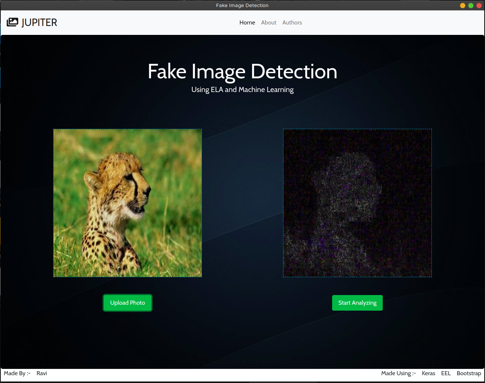
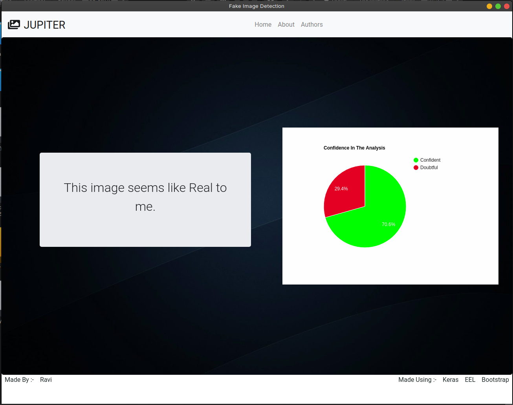
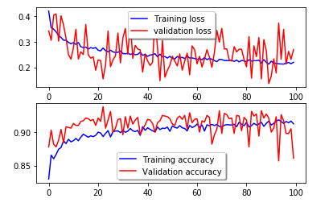
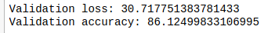
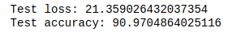

# Fake-Image-Detection

Application Front:-

Application Results Page:-

This project uses python libraries like Keras and Tensorflow to tell If an Image has been manipulated or not. I chose the approach of using transfer learning for getting more accurate results.In this project the images are firstly connverted into Error Level Analysis(ELA) images and then fed to the neural network for training.I used the VGG16 model for transfer learning. 

This project requires the following dependencies:-
 * EEl - Used for displaying webpages using a local host environment,it also allows python functions to be implemented in JavaScript
 * Keras
 * Tensorflow
 * Pillow
 * Numpy
 * Pandas
 * Tkinter
 
Results:-

Training Graph:-

Validation Results:-

Testing Results:-

 Futher Things That can be Enhanced:-
  * Improving the accuracy of the neural network
  * Increasing the dataset and then training the neural network.
  * Using a different model like ResNet50 for transfer learning.
